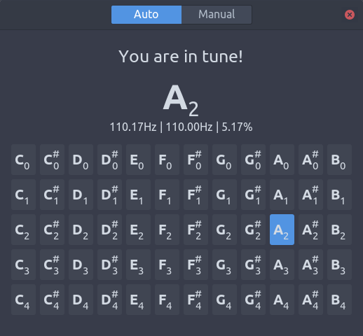

# GuitarTuner

## What it does

- get audio from mic
- resample the audio
- do fast fourier transformation every 0.1s, transform audio signal to frequence domain
- do [hps](https://cnx.org/contents/i5AAkZCP@2/Pitch-Detection-Algorithms), get fundamental frequency
- compare the obtained frequency whih standard frequency of note(C0 - B4)
- find the nearest standard note, get how flat or sharp obtained note from it

## Dependencies
- gtk+-3.0
- gstreamer-1.0
